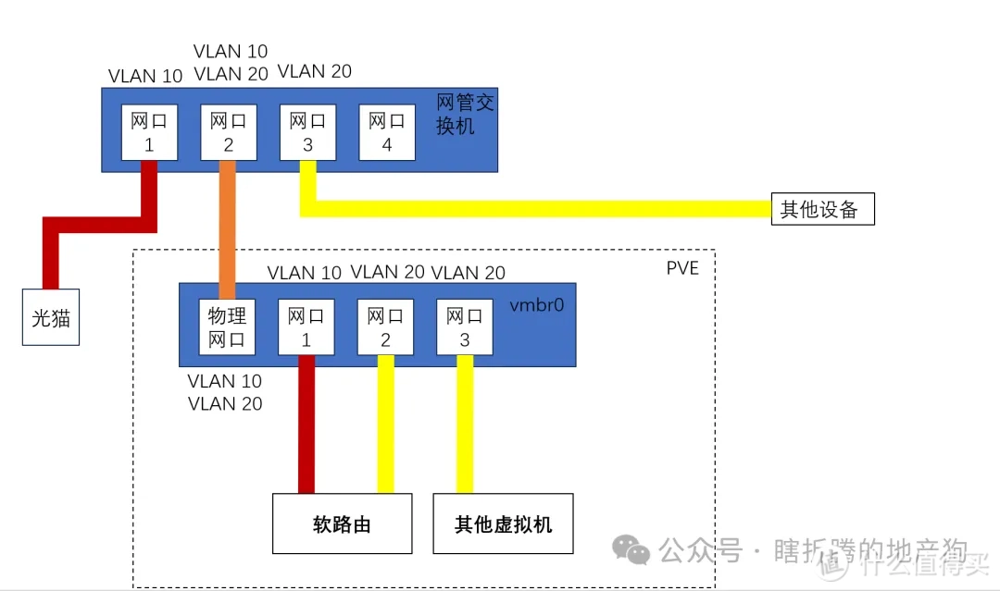

# 安装 PVE 系统

## 1. 制作启动盘

参照 [制作 U 盘启动盘](./制作U盘启动盘.md)

## 2. 下载 PVE 系统镜像

下载后放入 U 盘启动盘内。

## 3. 安装 PVE 系统

1. 插入启动盘，开机 进入 BIOS，选择 U 盘启动。
2. 选择安装 Proxmox VE。
3. 安装过程中，留意以下几点：
   - 选择安装位置: 不要选择 U 盘
   - 设置 locale: 选择 China, 时区选择 Asia/Shanghai, 键盘选择 US
   - 设置密码: 该密码对应于 root 用户
   - 设置主机名: 例如 `pve.localmachine`
   - 设置 DNS: 例如阿里云公共 DNS `223.5.5.5`
   - 设置邮箱
   - 设置网络:
     - 选择网卡 (我选择了 ***eth0***)
     - 如果接入了网络，自动会填入当前的 IP、网关、掩码等信息
     - 否则，手动设置。该 IP 会作为 PVE 的管理 IP

## 4. 安装成功后的操作

### 如何连接到 PVE

管理页面 URL: `https://<IP>:8006/`

在管理页面的登录界面，输入用户名 `root` 和密码。

在管理页面的 shell 界面可以登录到终端。

### 配置的 IP 并非有效的局域网 IP, 怎么办

方法 1: 电脑使用网线直连管理网口，设置电脑的网口 IP 与管理网口 IP 在同一网段，然后通过浏览器可以访问管理页面。
方法 2: 主机连接显示器，键盘，直接在主机上登录。

上述方法登录后，修改 web 管理 IP。

### 如何修改 web 管理 IP

修改以下几处

1. `vi /etc/network/interfaces`
2. `vi /etc/hosts`
3. `vi /etc/issue`

然后执行 `reboot` 命令，重启 PVE。

### 如何关机

```sh
shutdown -h now
```

### 更新源

编辑:

- `/etc/apt/sources.list.d/pve-enterprise.list`
- `/etc/apt/sources.list.d/ceph.list`

注释掉类似的行 (企业版的源，个人版会报 401 Unauthorized 错误)

```sh
# deb https://enterprise.proxmox.com/debian/pve bookworm pve-enterprise
```

更新

```sh
apt update
apt upgrade
```

### 设置网卡

> [PVE 系列之一：网口桥接或直通](https://www.cnblogs.com/Yogile/p/17862514.html)

安装 `ethtool` (我用的版本已经自带了)

```sh
apt install ethtool -y
```

我们希望检查和确认如下的**网卡配置**:

认知名 | 系统设备名 | 设备位置(bus-info) | 软路由设备名
-----|--------|--------------|------------
Eth0 | enp2s0 | 0000:02:00.0 | Eth0（桥接）
Eth1 | enp3s0 | 0000:03:00.0 | Eth1
Eth2 | enp4s0 | 0000:04:00.0 | Eth2
Eth3 | enp5s0 | 0000:05:00.0 | Eth3

#### 检查网卡

```sh
# 查看网卡信息 `ethtool -i [系统设备名]`
ethtool -i enp2s0
# 遍历所有网卡
lspci | grep -i 'eth'
```

#### 检查网口和 Ethx 的对应关系

在 PVE 网页端，将除 Eth3 以外的 3 个网卡设置为自动启动。

**使用闪光确认**

```sh
ethtool -p [系统设备名]
```

如果显示:

```sh
Cannot identify NIC: Operation not supported
```

说明系统不支持闪光，需要用下述方法一个个试。

**使用网线确认**

逐个网口插入网线，执行如下命令，观察命令输出:

```sh
ethtool [系统设备名]
```

显示：

- "Speed: Unknown! Duplex: Unknown! (255)" 则为未连接网线；
- "Speed: 2500Mb/s Duplex: Full" 则为已连接网线

网卡配置表格确认后，在 PVE 网页端，将除 Eth3 以外的 3 个网卡 取消 自动启动。

拔掉所有除管理口以外的网线。

#### 设置硬件直通

编辑 grub 配置文件 `/etc/default/grub`

注释掉原条目，并新增一条:

```sh
# GRUB_CMDLINE_LINUX_DEFAULT="quiet"
GRUB_CMDLINE_LINUX_DEFAULT="quiet intel_iommu=on"
```

执行 `update-grub` 更新 grub 配置。

然后重启 PVE。(`reboot`)

## 5. FAQ

### 什么是虚拟网桥

虚拟网桥的作用是给PVE系统内的虚拟机设置虚拟网口连接用的，虽然叫网桥，我们可以把他想象成只有0-N个物理接口以及很多个内部虚拟接口的交换机，如下图所示。


### 一些虚拟机网络结构的例子

#### 案例1


2.5G网卡直通NAS，其他的虚拟机全部接到PVE管理IP对应的网桥上。
为了虚拟机内的存储挂载读写速度NAS也有一个虚拟网口和虚拟网桥连接，然后两个网口接到交换机上去，整体比较简单。

#### 案例2



全PVE设备总共就一个网口还需要将主路由也放在PVE内。
不推荐这种接法，因为所有流量都走这一条网线而且还有主路由，网络不稳定性比较大，容易boom。
这里只是拿这个举例子什么是VLAN。

图上红色的网线就是路由器WAN口的连接，黄色的就是局域网内的连接，橙色的线就是既要负责WAN口也要负责LAN口的线。
我们通过将WAN口网线设计的网口VLAN tag设为10，LAN口的设为20，交换机的网口2设为Trunk接口跑两个VLAN tag，就可以实现单线复用在PVE主机只有一个网口的情况下运行主路由。
