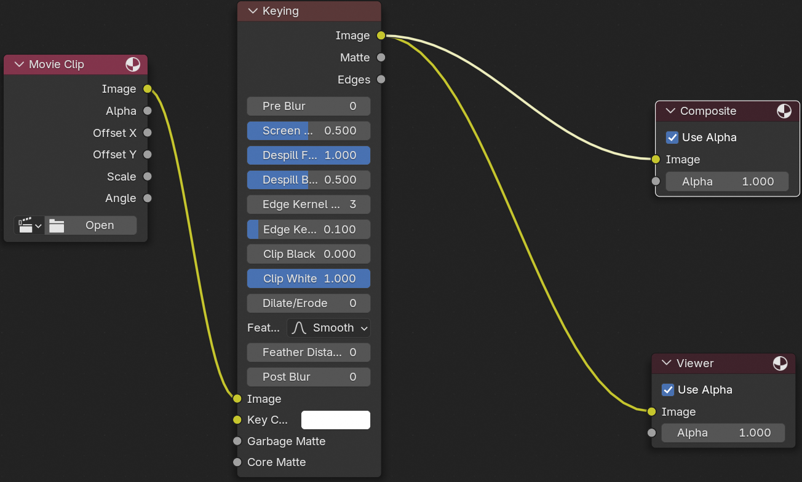

# Blender 抠绿幕(keying)

在 Compositing 界面，使用 keying node 来抠绿幕。

1. 进入 Compositing 界面
2. 启动 [ ] Use Nodes 选项
3. 新增 `Input` -> `Movie Clip` 节点，选择要处理的视频
4. 新增 `Key` -> `Keying` 节点，将 `Image` 连接到 `Image`。
5. 新增 `Viewer` 节点，将 `Keying` 输出的 `Image` 连接到 `Viewer` 的 `Image`，查看效果。
6. 选择 `Keying` 节点 `Key Color` 的颜色为背景颜色（可用取色工具取色）。
7. 将 `Keying` 输出的 `Image` 连接到 `Composite` 的 `Image`。
8. 调整渲染参数，进行渲染。

参考图片:

