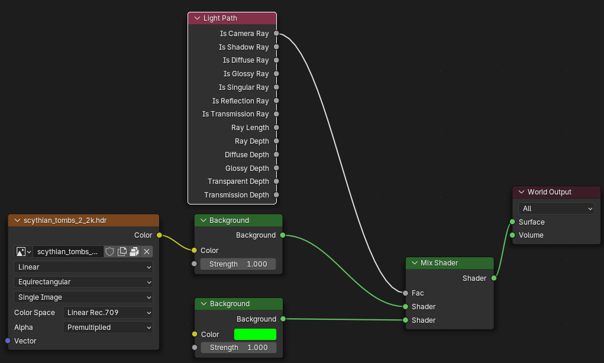

# Blender 渲染绿幕视频

在 Shading 界面，使用 mix shader 来制作绿幕背景。

1. 进入 Shading 界面
2. shader type 选择 `world`
3. 新增 `Shader` -> `Mix Shader` 节点，将 `Background` 连接到 `Shader`(1)。
4. 新建一个 `Shader` -> `Background` 节点，将 `Color` 设置为绿色。
5. 将 `Background` 输出的 `Shader` 连接到 `Mix Shader` 的 `Shader`(2)。
6. 将 `Mix Shader` 输出的 `Shader` 连接到 `World Output` 的 `Surface`。
7. 新建 `Light Path` 将 `Is Camera Ray` 输出的 `Fac` 连接到 `Mix Shader` 的 `Fac`。
8. 调整渲染参数，进行渲染。

参考图片:

