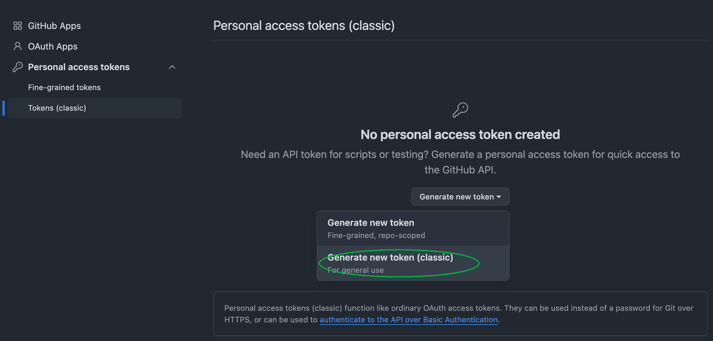

# Docker 登录 ghcr.io

ghcr (Github Container Registry) 是 GitHub 的容器镜像仓库，用于存储和分发容器镜像。

## 创建登录 Token

登录 ghrc.io 需要使用 GitHub 的 [Personal access tokens](https://github.com/settings/tokens)。

访问 <https://github.com/settings/tokens> 创建 Personal access token (Classic)。



Token 需要的权限有:

- `repo` 权限，用于访问仓库
- `read:packages` 权限，用于访问包
- `write:packages` 权限，用于推送包

## 登录

```bash
docker login ghcr.io
```

输入用户名，为 GitHub 的用户名。
输入密码，为刚才创建的 token。
