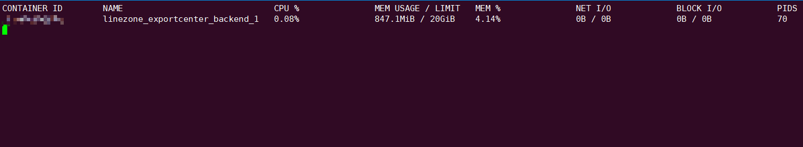

# 理解 Docker 的 CPU 使用率

>【CPU %】参数反映的是
>
> - 在两个抽样时间之间，在容器被分配到的 CPU 核上，**CPU 使用率的上升/下降有多大程度是由容器造成的**
> - 它的值为 100%不代表它使用了宿主机一个 CPU 内核的全部资源
> - 由于结果乘上了 CPU 核数，因此当一个容器使用 n 个 CPU 内核时，它的 **取值范围为 0~100×n**

通过 `docker stats` 命令我们可以查看一个容器的 CPU、内存、IO 等资源使用情况。



其中【CPU %】这项参数的值含义与宿主机的 cpu 利用率的含义是不同的，为了避免对这个参数的误解，我们从参数的计算方法出发看它的含义。

## 一、几个概念

- 宿主机的 CPU 使用量（`SystemUsage`）：运行 docker 的宿主机的 CPU 利用率。
- 容器的 CPU 使用量（`TotalUsage`）：运行在 docker 中的容器的平均每个核的 CPU 利用率。
- 每个核的 CPU 使用量（`PercpuUsage`）：容器对分配给它的各个 CPU 的利用率。通过 `len(PercpuUsage)` 可以知道容器被分配了几个核。

## 二、计算步骤

1. `cpuDelta`：容器的 CPU 使用量（`TotalUsage`）的变化量 = 先前的使用量 - 现在的使用量

2. `systemDelta`：宿主机的 CPU 使用量（`SystemUsage`）的变化量 = 先前的使用量 - 现在的使用量

3. 总的容器 CPU 利用率变化：每个核的容器的 CPU 使用量（`cpuDelta`） * 容器被分配的核数 `（len(PercpuUsage)`）

4. **CPU % = 总的容器 CPU 利用率变化 / `systemDelta` × 100**

源码如下：

```go
func calculateCPUPercentUnix(previousCPU, previousSystem uint64, v *types.StatsJSON) float64 {
  var (
    cpuPercent = 0.0
    // calculate the change for the cpu usage of the container in between readings
    cpuDelta = float64(v.CPUStats.CPUUsage.TotalUsage) - float64(previousCPU)
    // calculate the change for the entire system between readings
    systemDelta = float64(v.CPUStats.SystemUsage) - float64(previousSystem)
  )

  if systemDelta > 0.0 && cpuDelta > 0.0 {
    cpuPercent = (cpuDelta / systemDelta) * float64(len(v.CPUStats.CPUUsage.PercpuUsage)) * 100.0
  }
  return cpuPercent
}
```

## 三、总结

【CPU %】参数反映的是

- 在两个抽样时间之间，在容器被分配到的 CPU 核上，**CPU 使用率的上升/下降有多大程度是由容器造成的**
- 它的值为 100%不代表它使用了宿主机一个 CPU 内核的全部资源
- 由于结果乘上了 CPU 核数，因此当一个容器使用 n 个 CPU 内核时，它的 **取值范围为 0~100×n**

## 参考资料

1. [In docker cpu usage calculation what are: TotalUsage, SystemUsage, PercpuUsage and what does the calculation means?](https://stackoverflow.com/questions/35692667/in-docker-cpu-usage-calculation-what-are-totalusage-systemusage-percpuusage-a)
2. [docker 源码](https://github.com/moby/moby/blob/eb131c5383db8cac633919f82abad86c99bffbe5/cli/command/container/stats_helpers.go#L175-L188)
