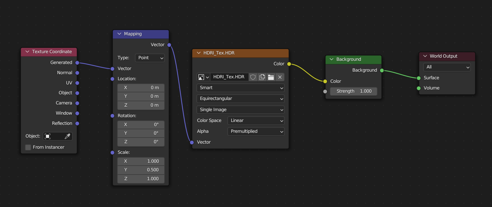

# Blender 旋转、缩放 HDRI 背景

Scaling a HDRI requires the same node setup as rotating a HDRI in Blender:

- feed a `Texture Coordinate` node into a `Mapping` Node
- set it to Type `Point`
- scale on the Y Axis

参考图片:

