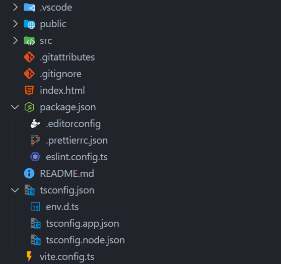

# VSCode 的文件嵌套 (FileNesting) 功能

## 1 - FileNesting 功能

VSCode 从 v1.67 版本 () 开始支持支持基于文件名对相关文件进行嵌套。

文件嵌套功能可以使相关文件在资源管理器中以树形结构显示，便于用户查看和管理相关文件。比如，`package.json` 文件可以嵌套 `package-lock.json`、`.yarnrc`、`.eslint*` 等文件。

效果如下:



> 这是一个 Vue3 项目的例子，项目是通过 `npm create vue@latest` 创建的，默认配置了项目的 fileNesting

## 2 - 配置 FileNesting 功能

有几个选项可以控制此行为：

* `explorer.fileNesting.enabled`: 控制是否全局启用文件嵌套功能。可以全局设置或针对特定工作区设置。
* `explorer.fileNesting.expand`: 控制嵌套文件默认是否展开。
* `explorer.fileNesting.patterns`: 控制文件如何嵌套。默认配置为 TypeScript 和 JavaScript 项目提供嵌套智能提示，但建议您根据自己的项目结构进行修改。

Example:

```json
{
  "explorer.fileNesting.enabled": true,
  "explorer.fileNesting.patterns": {
    "tsconfig.json": "tsconfig.*.json, env.d.ts",
    "vite.config.*": "jsconfig*, vitest.config.*, cypress.config.*, playwright.config.*",
    "package.json": "package-lock.json, pnpm*, .yarnrc*, yarn*, .eslint*, eslint*, .prettier*, prettier*, .editorconfig"
  },
}
```

## 3 - 相关模板、插件

[Anthony Fu](https://github.com/antfu) 的 [vscode-file-nesting-config](https://github.com/antfu/vscode-file-nesting-config) 项目提供了一份配置模板，

并且提供了一个 VSCode 插件: [File Nesting Updater](https://marketplace.visualstudio.com/items?itemName=antfu.file-nesting)，安装后可以自动配置文件嵌套功能。


