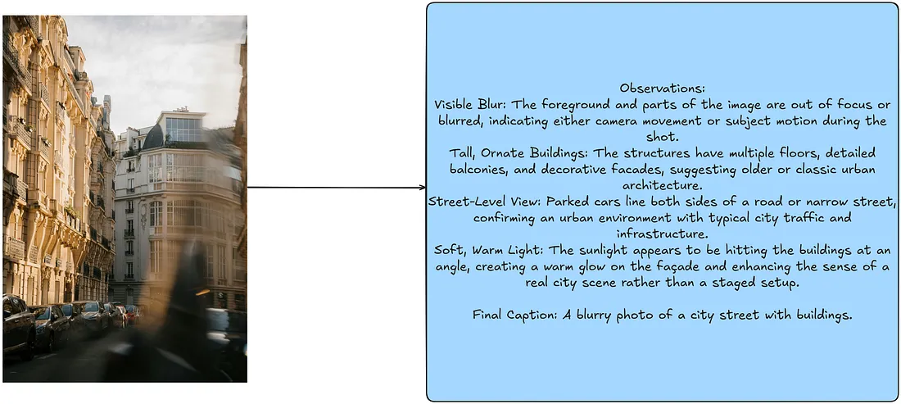

# Prompting Vision Language Models

> Ref:
> [Prompting Vision Language Models](https://medium.com/data-science/prompting-with-vision-language-models-bdabe00452b7)

Vision Language Models (VLMs) 是结合了视觉和语言的模型。VLM 是多模态的，可以处理同时需要视觉和文本理解的任务。

VLM 在训练时，利用 cross-attention 技术，将图像和文本对齐到相同的 representation 或 vector space。

## 1. VLM Prompting 范式

常见的提示词范式(prompting paradigms)有:

* zero-shot
* few-shot
* chain-of-thought

其他 deep learning 方法也可以帮助指导 prompting VLMs，例如: 在提示词策略(prompting strategies)中加入目标检测。

## 2. Zero-Shot Prompting

Zero-shot prompting 是指用户仅通过 system 和 user prompt 提供对任务的描述，以及要处理的图像。在这个情况下，VLM 仅依赖任务描述来生成输出。

相比于其他范式，Zero-shot prompting 向模型提供的信息是最少的。


### 2.1 如何进行 Zero-Shot Prompting

对于符合 OpenAI 接口规范的模型，可以将图片编码为 base64 格式，然后将其嵌入到 JSON 对象中。

例如：

```json
{
  "role": "system",
  "content": "You are a helpful assistant that can analyze images and provide captions."
},
{
  "role": "user",
  "content": [
    {
      "type": "text",
      "text": "Please analyze the following image:"
    },
    {
      "type": "image_url",
      "image_url": {
        "url": "data:image/jpeg;base64,{base64_image}",
        "detail": "detail"
      }
    }
  ]
}
```

上述例子中只包含了一个图片，但是也可以扩展为包含多个图片。

### 2.2 构造 Prompts

```python
def encode_image(image_path) -> str | None:
    """
    Encodes an image to a base64 string.

    Args:
        image_path (str): The file path of the image to encode.

    Returns:
        str: Base64-encoded string of the image, or None if an error occurs.
    """
    try:
        with open(image_path, "rb") as image_file:
            return base64.b64encode(image_file.read()).decode("utf-8")
    except Exception as e:
        print(f"Error encoding image: {e}")
        return None

def llm_chat_completion(messages, model="gpt-4o-mini", max_tokens=300, temperature=0.0):
    """
    Calls OpenAI's ChatCompletion API with the specified parameters.

    Args:
        messages (list): A list of message dictionaries for the conversation.
        model (str): The model to use for the chat completion.
        max_tokens (int, optional): Maximum tokens for the response. Defaults to 300.
        temperature (float, optional): Sampling temperature for randomness. Defaults to 0.0.

    Returns:
        str or None: The response content from the API, or None if an error occurs.
    """
    try:
        response =  client.chat.completions.create(
            model=model,
            messages=messages,
            max_tokens=max_tokens,
            temperature=temperature
        )
        return response.choices[0].message.content
    except Exception as e:
        print(f"Error calling LLM: {e}")
        return None

def build_few_shot_messages(few_shot_prompt, user_prompt="Please analyze the following image:", detail="auto"):
    """
    Generates few-shot example messages from image-caption pairs.

    Args:
        few_shot_prompt (dict): A dictionary mapping image paths to metadata,
                                including "image_caption".
        detail (str, optional): Level of image detail to include. Defaults to "auto".

    Returns:
        list: A list of few-shot example messages.
    """
    few_shot_messages = []
    for path, data in few_shot_prompt.items():
        base64_image = encode_image(path)
        if not base64_image:
            continue  # skip if failed to encode
        caption = data

        few_shot_messages.append(
            {
                "role": "user",
                "content": [
                    {"type": "text", "text": user_prompt},
                    {
                        "type": "image_url",
                        "image_url": {
                            "url": f"data:image/jpeg;base64,{base64_image}",
                            "detail": detail
                        }
                    },
                ]
            }
        )
        few_shot_messages.append({"role": "assistant", "content": caption})
    return few_shot_messages

def build_user_message(image_path, user_prompt="Please analyze the following image:", detail="auto"):
    """
    Creates a user message for analyzing a single image.

    Args:
        image_path (str): Path to the image file.
        detail (str, optional): Level of image detail to include. Defaults to "auto".

    Returns:
        dict or None: The user message dictionary, or None if image encoding fails.
    """
    base64_image = encode_image(image_path)
    if not base64_image:
        return None

    return {
        "role": "user",
        "content": [
            {"type": "text", "text": user_prompt},
            {
                "type": "image_url",
                "image_url": {
                    "url": f"data:image/jpeg;base64,{base64_image}",
                    "detail": detail
                }
            },
        ]
    }
```

利用上述函数，可以构建 zero-shot prompting 的 messages。

```python
def get_image_caption(
    image_path,
    few_shot_prompt=None,
    system_prompt="You are a helpful assistant that can analyze images and provide captions.",
    user_prompt="Please analyze the following image:",
    model="gpt-4o-mini",
    max_tokens=300,
    detail="auto",
    llm_chat_func=llm_chat_completion,
    temperature=0.0,
):
    """
    Gets a caption for an image using a LLM.

    Args:
        image_path (str): File path of the image to be analyzed.
        few_shot_prompt (dict, optional): Maps image paths to {"image_caption": <caption>}.
        system_prompt (str, optional): Initial system prompt for the LLM.
        user_prompt (str, optional): User prompt for the LLM.
        model (str, optional): LLM model name (default "gpt-4o-mini").
        max_tokens (int, optional): Max tokens in the response (default 300).
        detail (str, optional): Level of detail for the image analysis (default "auto").
        llm_chat_func (callable, optional): Function to call the LLM. Defaults to `llm_chat_completion`.
        temperature (float, optional): Sampling temperature (default 0.0).

    Returns:
        str or None: The generated caption, or None on error.
    """
    try:
        user_message = build_user_message(image_path, detail)
        if not user_message:
            return None

        # Build message sequence
        messages = [{"role": "system", "content": system_prompt}]

        # Include few-shot examples if provided
        if few_shot_prompt:
            few_shot_messages = build_few_shot_messages(few_shot_prompt, detail)
            messages.extend(few_shot_messages)

        messages.append(user_message)

        # Call the LLM
        response_text = llm_chat_func(
            model=model,
            messages=messages,
            max_tokens=max_tokens,
            temperature=temperature
        )
        return response_text

    except Exception as e:
        print(f"Error getting caption: {e}")
        return None

def process_images_in_parallel(
    image_paths,
    model="gpt-4o-mini",
    system_prompt="You are a helpful assistant that can analyze images and provide captions.",
    user_prompt="Please analyze the following image:",
    few_shot_prompt = None,
    max_tokens=300,
    detail="auto",
    max_workers=5,
):
    """
    Processes a list of images in parallel to generate captions using a specified model.

    Args:
        image_paths (list): List of file paths to the images to be processed.
        model (str): The model to use for generating captions (default is "gpt-4o").
        max_tokens (int): Maximum number of tokens in the generated captions (default is 300).
        detail (str): Level of detail for the image analysis (default is "auto").
        max_workers (int): Number of threads to use for parallel processing (default is 5).

    Returns:
        dict: A dictionary where keys are image paths and values are their corresponding captions.
    """
    captions = {}
    with ThreadPoolExecutor(max_workers=max_workers) as executor:
        # Pass additional arguments using a lambda or partial
        future_to_image = {
            executor.submit(
                get_image_caption,
                str(image_path),
                few_shot_prompt,
                system_prompt,
                user_prompt,
                model,
                max_tokens,
                detail): image_path
            for image_path in image_paths
        }

        # Use tqdm to track progress
        for future in tqdm(as_completed(future_to_image), total=len(image_paths), desc="Processing images"):
            image_path = future_to_image[future]
            try:
                caption = future.result()
                captions[image_path] = caption
            except Exception as e:
                print(f"Error processing {image_path}: {e}")
                captions[image_path] = None
    return captions
```

然后可以用下面的代码来处理多张图片，并获得它们的 caption：

```python
from tqdm import tqdm
from pathlib import Path

IMAGE_QUALITY = "high"
PATH_TO_SAMPLES = "images/"

system_prompt = """You are an AI assistant that provides captions of images.
You will be provided with an image. Analyze the content, context, and notable features of the images.
Provide a concise caption that covers the important aspects of the image."""

user_prompt = "Please analyze the following image:"

image_paths = list(Path(PATH_TO_SAMPLES).iterdir())

zero_shot_high_quality_captions = process_images_in_parallel(
    image_paths,
    model="gpt-4o-mini",
    system_prompt=system_prompt,
    user_prompt=user_prompt,
    few_shot_prompt=None,
    detail=IMAGE_QUALITY,
    max_workers=5,
)
```

输出:


## 3. Few-Shot Prompting

Few-shot prompting 是指用户提供了一些示例，以便模型更好地理解任务。

Few-shot prompting 的好处是为任务提供了更多的上下文信息，使模型能够更好地理解任务。


### 3.1 如何进行 Few-Shot Prompting

利用上述的函数，我们提供几张图片作为 few-shot 示例，然后调用模型生成 caption。

```python
image_captions = json.load(open("image_captions.json"))
FEW_SHOT_EXAMPLES_PATH = "few_shot_examples/"
few_shot_samples = Path(FEW_SHOT_EXAMPLES_PATH).iterdir()
few_shot_captions = {
    k.as_posix(): v
    for k, v in image_captions.items()
    if k in few_shot_samples
}

IMAGE_QUALITY = "high"
few_shot_high_quality_captions = process_images_in_parallel(
    image_paths,
    model="gpt-4o-mini",
    few_shot_prompt= few_shot_captions,
    detail=IMAGE_QUALITY,
    max_workers=5,
)
```

输入:


输出:


## 4. Chain-of-Thought Prompting

Chain of Thought (CoT) prompting 最初用在 LLMs 中，它使得模型可以将复杂问题拆解为更简单的中间步骤，并鼓励模型在回答前“思考”。

该技术可以无需任何修改，直接用在 VLMs 中。主要区别是 VLMs 可以同时使用图像和文本信息作为输入。



### 4.1 构造 Chain-of-Thought Trace

Example:

```python
few_shot_samples_1_cot = """Observations:
Visible Blur: The foreground and parts of the image are out of focus or blurred, indicating either camera movement or subject motion during the shot.
Tall, Ornate Buildings: The structures have multiple floors, detailed balconies, and decorative facades, suggesting older or classic urban architecture.
Street-Level View: Parked cars line both sides of a road or narrow street, confirming an urban environment with typical city traffic and infrastructure.
Soft, Warm Light: The sunlight appears to be hitting the buildings at an angle, creating a warm glow on the façade and enhancing the sense of a real city scene rather than a staged setup.

Final Caption: A blurry photo of a city street with buildings."""

few_shot_samples_2_cot = """Observations:
Elevated Desert Dunes: The landscape is made up of large, rolling sand dunes in a dry, arid environment.
Off-Road Vehicle: The white SUV appears equipped for travel across uneven terrain, indicated by its size and ground clearance.
Tire Tracks in the Sand: Visible tracks show recent movement across the dunes, reinforcing that the vehicle is in motion and navigating a desert path.
View from Inside Another Car: The dashboard and windshield framing in the foreground suggest the photo is taken from a passenger’s or driver’s perspective, following behind or alongside the SUV.

Final Caption: A white car driving on a desert road."""


few_shot_samples_3_cot = """Observations:
Towering Rock Formations: The steep canyon walls suggest a rugged desert landscape, with sandstone cliffs rising on both sides.
Illuminated Tents: Two futuristic-looking tents emit a soft glow, indicating a nighttime scene with lights or lanterns inside.
Starry Night Sky: The visible stars overhead reinforce that this is an outdoor camping scenario after dark.
Single Male Figure: A man, seen from behind, stands near one of the tents, indicating he is likely part of the camping group.

Final Caption: A man standing next to a tent in the desert."""
```

### 4.2 执行 Chain-of-Thought Prompting

```python
import copy

few_shot_samples_cot = copy.deepcopy(few_shot_captions)

few_shot_samples_cot["few_shot_examples/photo_1.jpg"] = few_shot_samples_1_cot
few_shot_samples_cot["few_shot_examples/photo_3.jpg"] = few_shot_samples_2_cot
few_shot_samples_cot["few_shot_examples/photo_4.jpg"] = few_shot_samples_3_cot

IMAGE_QUALITY = "high"
cot_high_quality_captions = process_images_in_parallel(
    image_paths,
    model="gpt-4o-mini",
    few_shot_prompt=few_shot_samples_cot,
    detail=IMAGE_QUALITY,
    max_workers=5,
)
```

VLM 现在可以将图片拆解为中间步骤，然后生成最终的 caption。

输出:


## 4. Object Detection Guided Prompting


TODO: 待补充
