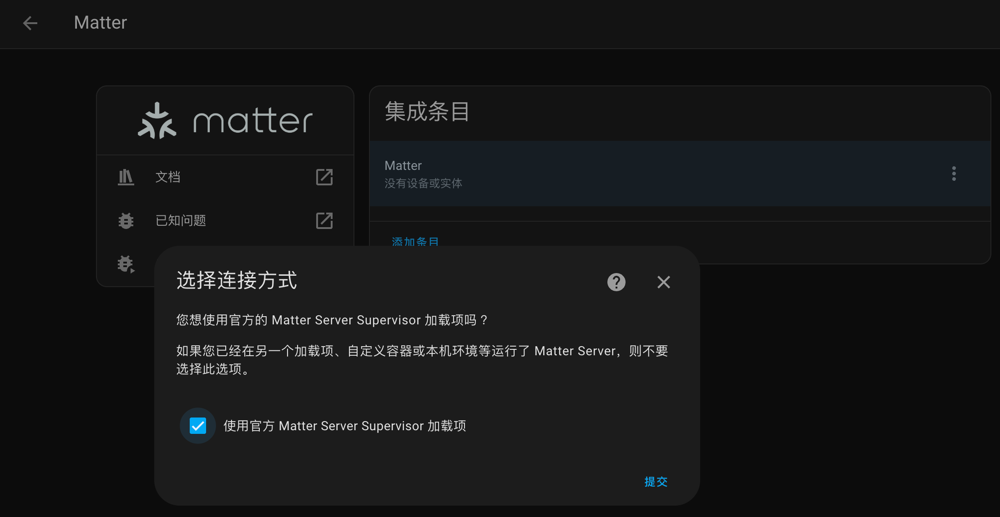
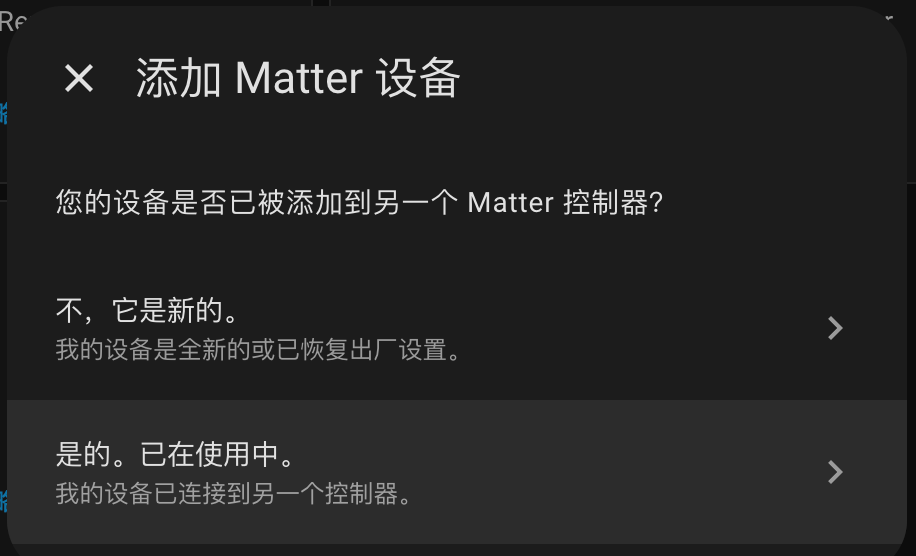
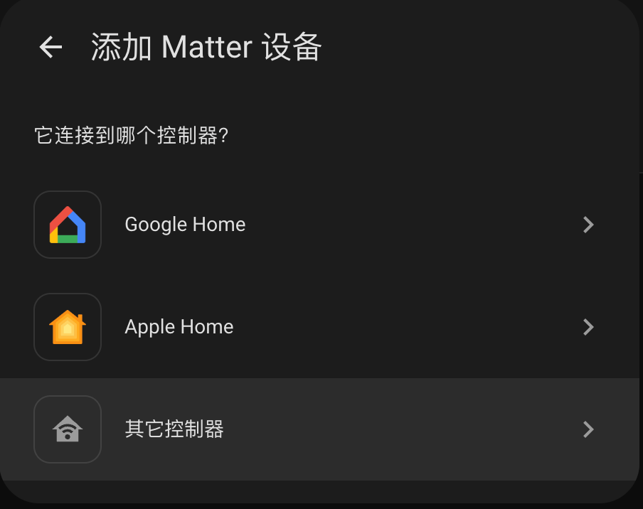

# Aqara 设备通过 Matter 接入 HomeAssistant

## 1 - 安装 Matter 集成

“设置” -> “设备与服务” -> “添加集成” -> 搜索 “Matter” -> 安装

安装完成后，在界面中点击“添加条目” -> “使用官方 Matter Server Supervisor 加载项” -> “提交”

## 2 - 添加 Aqara 设备

“设置” -> “设备与服务” -> “添加集成” -> 选择 “添加 Matter 设备”

并依次点击 “是的。已在使用中” -> “其他控制器”，然后出现输入设置代码的界面。

此时打开 Aqara 的 App, 在网关设备的设置页，找到通用设置中的“Matter 生态”，生成“Matter 配对码”。将其输入到 HomeAssistant 中，点击“提交”即可。

之后按照需求将设备添加到仪表盘即可。

## 3 - 问题排除

### 3.1 可能会出现"幽灵设备"的情况

Q: 如果在 Home Assistant 中连接好了 Aqara 网关，后在 Aqara 应用中将已连接的生态移除。此时 Home Assistant 会陷入已连接过的设备持续出现、无法单独删除也无法使用的情境。

此时可以删除 Matter 的集成条目，但是在此添加 Matter 时之前的"幽灵设备"又会丝滑的蹦出来。这种情况貌似是系统内的缓存，与 Aqara 无关，Aqara 断电后仍存在这种情况。

A: 解决方案是在加载项中把 Matter Server 删除数据并卸载，然后重启 Home Assistant 系统，之后回到文章开头按全新配置的流程走就可以。
