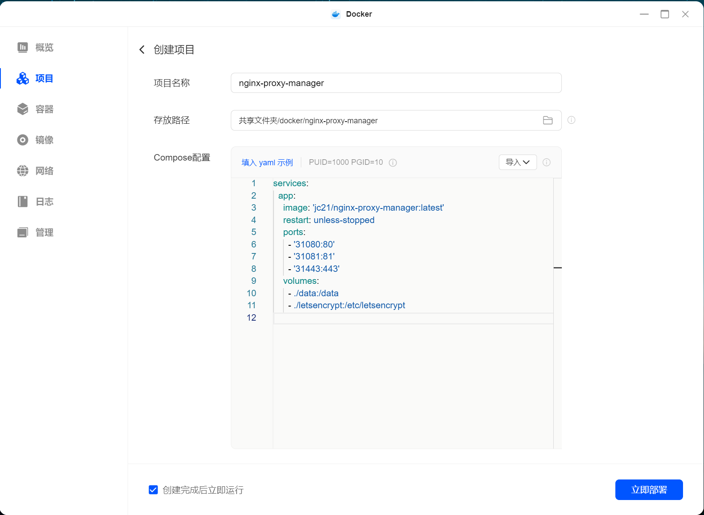

# Nginx Proxy Manager 服务部署

本文通过 Docker Compose 方式部署 Nginx Proxy Manager 服务到绿联的 NAS 上。

## 1 - 项目简介

> 项目主页: <https://nginxproxymanager.com/>

Nginx Proxy Manager 是一个开源的反向代理工具，支持通过 Web 界面管理 Nginx 配置。

## 2 - 部署方法

> 官方文档: <https://nginxproxymanager.com/guide/#quick-setup>

### 2.1 项目配置

编写 `docker-compose.yml` 的文件内容如下:

```yaml
services:
  app:
    image: 'jc21/nginx-proxy-manager:latest'
    restart: unless-stopped
    ports:
      - '31080:80'
      - '31081:81'
      - '31443:443'
    volumes:
      - ./data:/data
      - ./letsencrypt:/etc/letsencrypt
```

配置说明:

+ `31080:80`: 服务的 80 端口映射到本地的 31080 端口
+ `31081:81`: 服务的 81 端口映射到本地的 31081 端口
+ `31443:443`: 服务的 443 端口映射到本地的 31443 端口
+ `./data:/data`: 挂载数据目录
+ `./letsencrypt:/etc/letsencrypt`: 挂载证书目录

### 2.2 启动服务

进入 NAS 的管理界面，打开 Docker，在 "项目" 中点击 "创建"。

1. 项目名称：nginx-proxy-manager
2. 存放路径: `共享文件夹/docker/nginx-proxy-manager`
3. Compose 配置: 将上述 `docker-compose.yml` 的内容导入或复制到此处
4. 启动项目: 点击 “立即部署”



如果是在服务器上部署，可以通过 SSH 登录到服务器:

1. 创建项目目录 `mkdir nginx-proxy-manager`
2. 在目录中创建 `docker-compose.yml` 文件，在其中写入上述配置内容
3. 执行以下命令启动服务：

```bash
docker-compose up -d
```

### 3 - 初始化

部署完成后，打开浏览器访问 `http://<NAS-IP>:30081`，即可看到 Nginx Proxy Manager 的 Web 界面。

默认 Admin User:

```plaintext
Email:    admin@example.com
Password: changeme
```

登录后会提示修改密码，修改密码后即可正常使用。
