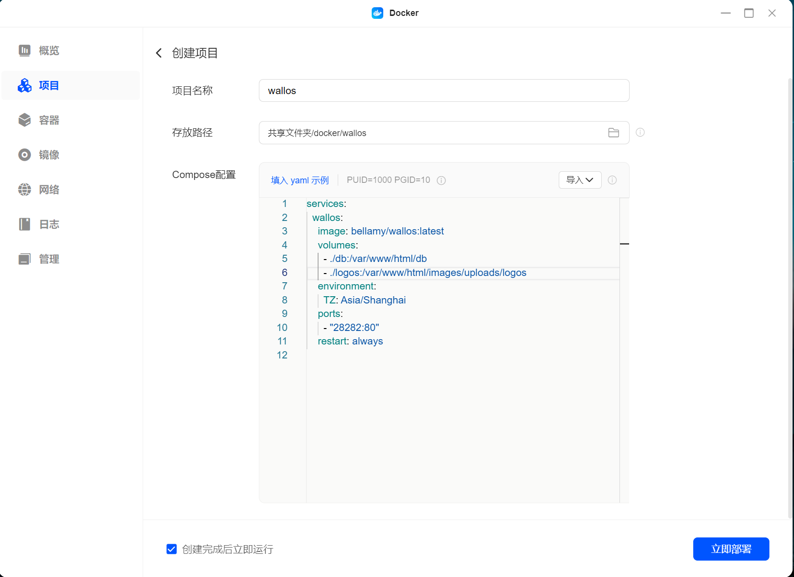

# Wallos: 个人订阅服务管理工具

> 参考文档：
>
> [在绿联NAS上搭建个人订阅服务管理工具 Wallos](https://support.ugnas.com/#/detail/eyJpZCI6MTQ2NCwidHlwZSI6InRhZzAwMiIsImxhbmd1YWdlIjoiemgtQ04iLCJjbGllbnRUeXBlIjoiUEMiLCJhcnRpY2xlSW5mb0lkIjo1MDMsImFydGljbGVWZXJzaW9uIjoiIiwicGF0aENvZGUiOiIifQ==)

本文通过 Docker Compose 方式部署 Wallos 服务到绿联的 NAS 上。

也适用于部署到其他支持运行 Docker 容器的 NAS 或个人服务器。

## 1. 项目简介

> [Wallos 项目仓库](https://github.com/ellite/Wallos)

Wallos 是一款专为管理订阅服务设计的开源工具。

借助 Wallos，用户可以清晰地查看所有订阅情况，避免重复订阅或错过付款日期，从而更有效地控制个人支出。


## 2. 用 Docker Compose 部署 Wallos

### 2.1 项目配置

编写 `docker-compose.yml` 的文件内容如下:

```yaml
services:
  wallos:
    image: bellamy/wallos:latest
    volumes:
      - ./db:/var/www/html/db #数据库文件
      - ./logos:/var/www/html/images/uploads/logos #logo文件存放位置
    environment:
      TZ: Asia/Shanghai
    ports:
      - "28282:80"
    restart: always
```

其中可配置的变量有：

* `./db:/var/www/html/db`: 数据库文件存放在 `./db` 目录下
* `./logos:/var/www/html/images/uploads/logos`: logo 文件存放在 `./logos` 目录下
* `TZ: Asia/Shanghai`: 时区设置为 "Asia/Shanghai"
* `28282:80`: 端口映射为本地的 28282 端口

### 2.2 启动服务

进入 NAS 的管理界面，打开 Docker，在 "项目" 中点击 "创建"。

1. 项目名称：wallos
2. 存放路径: `共享文件夹/docker/wallos`
3. Compose 配置: 将上述 `docker-compose.yml` 的内容导入或复制到此处
4. 启动项目: 点击 “立即部署”



如果是在服务器上部署，可以通过 SSH 登录到服务器:

1. 创建项目目录 `mkdir wallos`
2. 在目录中创建 `docker-compose.yml` 文件，在其中写入上述配置内容
3. 执行以下命令启动服务：

```bash
docker-compose up -d
```

## 3. 初始化

部署完成后，可以通过 `http://<NAS-IP>:28282` 访问 Wallos 服务。

### 3.1 设置账号和密码

进到 wallos 首页，首先可以把语言切换为简体中文，主要货币切换为 Chinese Yuan（人民币）。

接着就可以设置用户名、邮箱和密码进行注册了。


注册成功后，会跳到登录界面，我们用前面注册的账户进行登录。

### 3.2 添加订阅

登录后，可以在首页添加订阅。


添加好订阅后，我们可以在首页查看到订阅的名称、支付频率和价格等基本信息。

## 4. 其他功能

* 订阅费用统计
* 货币汇率自动转换 (借助 Fixer API)
* 通知
