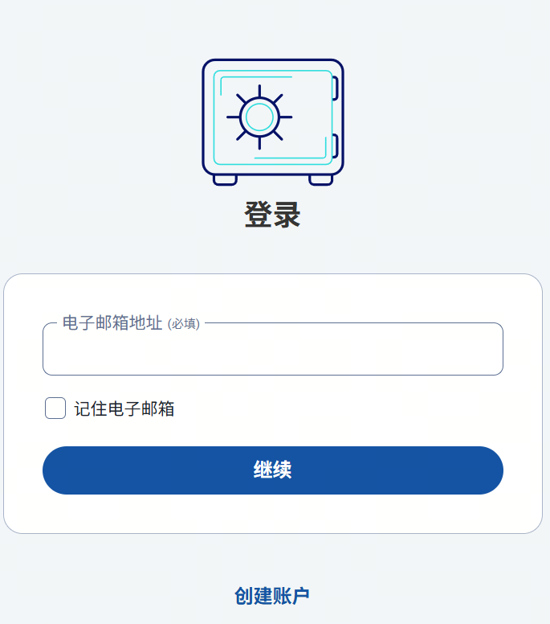
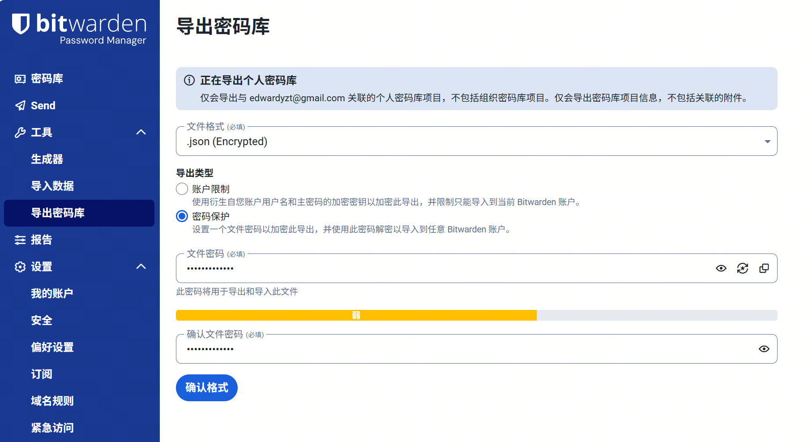
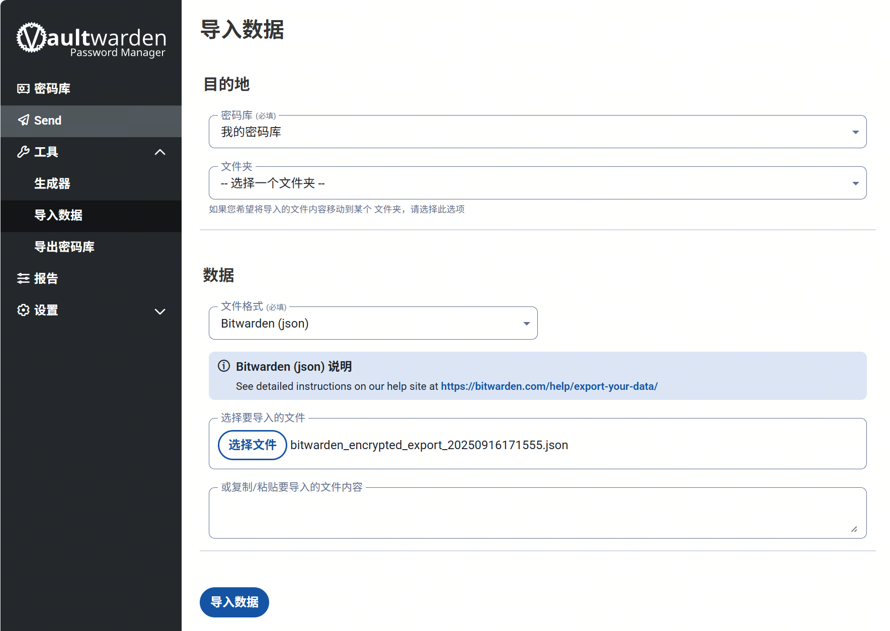

# Vaultwarden 个人密码管理服务部署

本文通过 Docker Compose 方式部署 Vaultwarden 服务到绿联的 NAS 上。同时也提供了通用的部署方法，可供在其他 Linux 服务器上部署时参考。

> 参考教程: [Vaultwarden Wiki 中文版](https://rs.ppgg.in/configuration/enabling-mobile-client-push-notification)

## 1 - 项目简介

[Bitwarden](https://bitwarden.com/) 是一款开源的密码管理服务，支持多平台客户端和浏览器插件，提供密码生成、存储、自动填充等功能。

Vaultwarden (前称 Bitwarden_RS) 是 Bitwarden 服务端的一款轻量级开源替代品，与官方的 Bitwarden 客户端兼容。它可以自托管，支持 Docker 部署，易于安装和维护。

> [Vaultwarden 项目仓库](https://github.com/dani-garcia/vaultwarden)

vaultwarden 服务必须通过 https 访问，建议结合内网穿透、反向代理和 SSL 证书一起使用。

## 2 - 使用 Docker Compose 部署 Vaultwarden

### 2.1 项目配置

编写 `docker-compose.yml` 的文件内容如下:

```yaml
services:
  vaultwarden:
    image: vaultwarden/server:latest
    container_name: vaultwarden
    restart: unless-stopped
    environment:
      # DOMAIN: "https://vaultwarden.example.com"
      SIGNUPS_ALLOWED: true
      INVITATIONS_ALLOWED: false
      TZ: 'Asia/Shanghai'
    volumes:
      - './vw-data:/data'
    ports:
      - '8000:80'
```

环境变量说明:

- `DOMAIN`: 当通过反向代理访问时需要设置，指定你的域名，确保 vaultwarden 知道使用 https 来正确处理附件等功能
- `SIGNUPS_ALLOWED`: 是否允许注册新用户，建议在创建好管理员账号后设置为 `false` 并重启服务，以防止陌生人注册
- `INVITATIONS_ALLOWED`: 是否允许邀请新用户，设置为 `false` 以防止陌生人邀请新用户

项目的挂载路径:

- `./vw-data:/data`: 保存的用户数据存放在 `./vw-data` 目录下。容器内路径为 `/data`，可以通过 `DATA_FOLDER` 环境变量修改。

> ! 由于用户密码数据比较重要，建议对存储目录进行定期备份。

项目的端口映射为本地的 8000 端口

### 2.2 部署服务

#### (1) 通过 NAS UI 部署

进入 NAS 的管理界面，打开 Docker，在 "项目" 中点击 "创建"。

1. 项目名称: vaultwarden
2. 存放路径(可自选): `共享文件夹/docker/vaultwarden/`
3. Compose 配置: 将上述 `docker-compose.yml` 的内容导入或复制到此目录下
4. 启动项目: 点击 “立即部署”

#### (2) 在 Linux Server 上部署

如果是在服务器上部署，可以通过 SSH 登录到服务器:

1. 进入服务器，选择一个合适的目录存放项目文件，比如 `~/docker`
2. 创建项目目录 `mkdir vaultwarden`
3. 在目录中创建 `docker-compose.yml` 文件，在其中写入上述配置内容
4. 执行以下命令启动服务：

```bash
docker-compose up -d
```

### 3 - 服务初始化

服务启动后，打开浏览器访问 `http://<NAS_IP>:18000`，进入 vaultwarden 的登录页面。

#### 3.1 创建账户

点击【创建账户】按钮，进入注册页面。



依次输入邮箱、名称（可选）、新主密码、确认新主密码，点击【创建账户】按钮，完成注册。

注册完成后，会自动登录。

#### 3.2 关闭注册

在 vaultwarden 的项目配置中，environment 中添加 `SIGNUPS_ALLOWED` 变量，值为 `false`，并重启服务。

#### 3.3 启用管理页面

启用管理页面前，需要先创建 ADMIN_TOKEN。他的值可以是任意字符串，建议使用随机字符串。

将以下设置添加到 `docker-compose.yml`:

```yaml
    environment:
      - ADMIN_TOKEN=some_random_token_as_per_above_explanation
```

重启服务。此后，管理页面将在 `/admin` 子路径中可用。

在管理页面首次保存设置时，将自动在 `DATA_FOLDER` 文件夹中生成 `config.json` 文件。该文件中的值优先于环境变量值。

#### 3.4 配置网址

如果有公网 IP，可以结合反向代理、DDNS 等方案，将 vaultwarden 的访问地址映射到公网。

如果没有公网 IP，可以结合 DDNSTO、节点小宝、花生壳等 内网穿透服务，将 vaultwarden 的访问地址映射到公网。

配置完成后，在 vaultwarden 的项目配置中，environment 中添加 `DOMAIN` 变量，值为映射后的服务域名，并重启服务。

#### 3.5 启用推送实现自动同步

从 Vaultwarden 1.29.0 版本开始，您可以激活移动客户端的推送通知，以在移动应用程序、网页扩展程序和网页密码库之间自动同步您的个人密码库，而无需手动同步。

1. 访问 <https://bitwarden.com/host/>，输入您的电子邮箱地址，Data Region 选择 "United States"，然后您将获得一个 INSTALLATION ID 和 KEY。
2. 将以下设置添加到 `docker-compose.yml`（并确保插入上一步获取到的正确 ID 和 KEY）：

```yaml
    environment:
      - PUSH_ENABLED=true
      - PUSH_INSTALLATION_ID=
      - PUSH_INSTALLATION_KEY=
```

重启服务。

### 4 - 使用方法

#### 4.1 导入数据

如果之前已经有 bitwarden 的账号数据，可以导入到 vaultwarden 中。

在 bitwarden 的 “工具 -> 导出密码库” 中，选择文件格式（建议加密），点击【确认格式】进行导出。



在 vaultwarden 的 “工具 -> 导入数据” 中，选择文件格式和文件，点击【导入数据】按钮。



#### 4.2 数据备份

默认情况下，Vaultwarden 使用 SQLite 运行，那么 SQL 数据库只是 `DATA_FOLDER` 文件夹 (默认是 `/data`) 中的一个文件。

数据目录结构如下:

```text
data
├── attachments          # 每一个附件都作为单独的文件存储在此目录下。
│   └── <uuid>           # （如果未创建过附件，则此 attachments 目录将不存在）
│       └── <random_id>
├── config.json          # 存储管理页面配置；仅在之前已启用管理页面的情况下存在。
├── db.sqlite3           # 主 SQLite 数据库文件。
├── db.sqlite3-shm       # SQLite 共享内存文件（并非始终存在）。
├── db.sqlite3-wal       # SQLite 预写日志文件（并非始终存在）。
├── icon_cache           # 站点图标 (favicon) 缓存在此目录下。
│   ├── <domain>.png
│   ├── example.com.png
│   ├── example.net.png
│   └── example.org.png
├── rsa_key.der          # ‘rsa_key.*’ 文件用于签署验证令牌。
├── rsa_key.pem
├── rsa_key.pub.der
└── sends                # 每一个 Send 的附件都作为单独的文件存储在此目录下。
    └── <uuid>           # （如果未创建过 Send 附件，则此 sends 目录将不存在）
        └── <random_id>
```

- `db.sqlite3`: 数据库文件，是备份的重
- `attachments`: 目录下的文件是附件，是备份的次重点。
- `sends`: Send 文件的附件，可选。
- `config.json`: 管理页面生成的配置，建议备份。
- `rsa_key*`: 用于对当前已登录用户的 JWT（验证令牌）进行签名，建议备份。
- `icon_cache`: 站点图标 (favicon) 缓存在此目录下，可选。建议不要备份，因为可以重新生成。

##### (1) 备份数据

使用 SQLite 命令行工具可以在线备份数据库，也可以使用 VACUUM 命令备份数据库，压缩备份文件:

```bash
# 不压缩
sqlite3 data/db.sqlite3 ".backup '/path/to/backups/db-$(date '+%Y%m%d-%H%M').sqlite3'"
# VACUUM 命令备份数据库，压缩备份文件
sqlite3 data/db.sqlite3 "VACUUM INTO '/path/to/backups/db-$(date '+%Y%m%d-%H%M').sqlite3'"
```

或者使用 docker compose 命令先停止服务，确保数据一致性，然后通过 scp 复制数据到远程服务器:

```bash
#!/bin/bash
docker-compose down
datestamp=$(date +%m-%d-%Y)
backup_dir="/home/<user>/vw-backups"
zip -9 -r "${backup_dir}/${datestamp}.zip" /opt/vw-data*
scp -i ~/.ssh/id_rsa "${backup_dir}/${datestamp}.zip" user@<REMOTE_IP>:~/vw-backups/
docker-compose up -d
```

##### (2) 恢复备份数据

确保首先删除任何已存在的 `db.sqlite3-wal` 文件，因为当 SQLite 试图使用陈旧/不匹配的 WAL 文件恢复 `db.sqlite3` 时，有可能导致数据库损坏。

不需要备份或恢复 `db.sqlite3-shm` 文件。

将已备份的数据替换到 `DATA_FOLDER` 文件夹中的相应数据。
