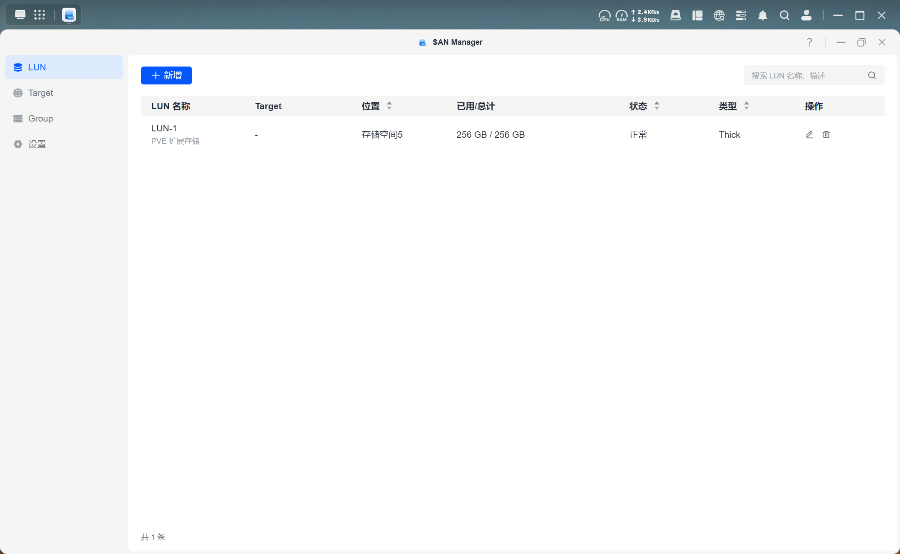
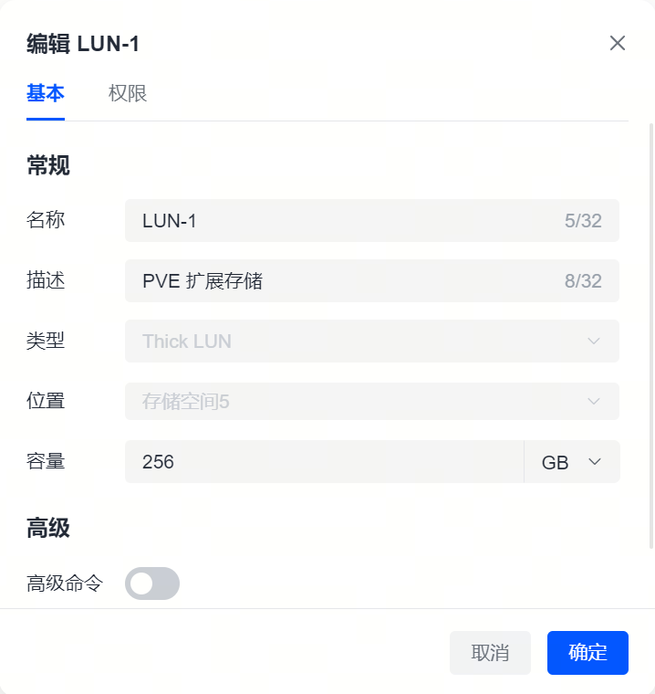

# 开启 iSCSI 服务

本文基于绿联 NAS 的 SAN Manager 应用开启 iSCSI 服务。

- 设备型号: DXP6800 Pro
- 系统版本: 1.9.0.0075
- 应用版本: SAN Manager 1.3.0.0044

> 绿联云教程文档: [SAN Manager](https://support.ugnas.com/knowledgecenter/#/detail/eyJpZCI6NTI3MiwidHlwZSI6InRhZzAwMSIsImxhbmd1YWdlIjoiemgtQ04iLCJjbGllbnRUeXBlIjoiUEMiLCJhcnRpY2xlSW5mb0lkIjo3MDYsImFydGljbGVWZXJzaW9uIjoiMS4wLjAuMDA0NiIsInBhdGhDb2RlIjoicHJvMDAyLEdiM0V5UiJ9)

## 1 - 什么是 iSCSI

**iSCSI (Internet Small Computer System Interface)** 是一种基于网络的块级存储协议，允许用户将 NAS 空间虚拟为一块远程硬盘 (LUN)，在客户端设备的系统中表现为本地磁盘。从而解决电脑磁盘空间不足问题。

iSCSI 核心功能亮点：

- 定义 iSCSI Target，并分配对应的 LUN (Logical Unit Number, 逻辑单元):
  - 这些 LUN 就像是 NAS 存储空间中被切割出来的独立“硬盘”，可以精确地映射到客户端设备 (Initiator) 上，用户可以通过 iSCSI 扩展个人电脑的存储空间。
- 支持精细的访问控制，用户可以通过 CHAP 认证等方式，严格控制哪些设备可以访问特定的 iSCSI 目标。只有经过授权的设备才能连接到虚拟磁盘。

如果需要使用 CHAP 验证，建议在使用 SAN Manager 部署初期配置好默认 CHAP 信息。

iSCSI 协议支持基于 IP 网络的远程连接，但 iSCSI 默认不加密传输内容，出于数据安全的考虑，**不建议用户将 iSCSI 服务暴露至公网使用**。

## 2 - SAN Manager 开启 iSCSI 服务

### 2.1 - 设置

在设置面板中，"默认 iSCSI CHAP" 配置中:

"CHAP 身份验证": 推荐开启。启用后，客户端通过用户名和口令进行认证。

- 名称: 自定义用户名
- 口令: 自定义口令 (12 位以上，包含大小写字母和数字，不支持特殊字符)

"启用相互 CHAP": 开启后客户端与服务器双方均需验证对方身份。在家庭内网环境可以不开启。

### 2.2 - LUN 管理

在 SAN Manager 应用中，LUN 页面用于集中管理所有已创建的虚拟磁盘，用户可在此页面查看 LUN 的运行状态、绑定关系、容量使用情况，并进行权限管理或操作配置。

| 功能      | 说明              |
|-----------|-------------------|
| LUN名称   | 自定义的 LUN 名称 |
| Target    | 当前 LUN 所绑定的 Target。一个 LUN 可绑定至一个 Target。 |
| 位置      | 当前 LUN 所在的存储空间路径 |
| 已用/总计 | 当前 LUN 已用空间/总容量 |
| 状态      | 当前 LUN 的状态: 正常、警告、损毁、只读、受保护 |
| 类型      | Thick LUN 或 Thin LUN |
| 操作      | 针对单个 LUN 的操作: 删除、编辑 |
| 新增      | 创建新的 LUN |

LUN 有两种存储方式：

- (推荐) Thick LUN 性能更强，但需预先占用固定空间，可能导致资源浪费
  - 优点: 性能稳定，无碎片化问题
  - 缺点: 需预先占用固定空间，可能导致资源浪费；不够灵活，无法动态调整空间
- Thin LUN 空间利用率高，但需监控存储池容量，避免因空间不足引发的故障
  - 优点: 空间利用率高，不会浪费空间; 灵活扩展，减少初始空间浪费。
  - 缺点: 可能因存储池空间不足导致写入失败

#### LUN 编辑页面

在【基本】标签页下，可以启用 "高级命令" 功能，开启后可能会影响性能。启用后，将支持以下 SCSI 指令：

- FUA (Force Unit Access): 表示写入操作直接写入存储介质，绕过缓存，确保数据实时落盘；
- Sync Cache: 要求客户端在提交写入操作后强制刷新缓存，确保数据一致性。

在【权限】标签页，可对该 LUN 的访问权限进行灵活管理，支持以下权限模式：

- (默认) 允许所有客户端读写: 所有连接该 Target 的客户端可对 LUN 进行读写操作；
- 自定义: 开启后可以控制哪些客户端组 (Group) 可以访问此 LUN，以及具体权限。

### 2.3 - Target 管理

| 功能 | 说明 |
|------|----------|
| Target 名称 | 用户为该 iSCSI 目标自定义的名称 |
| IQN (iSCSI Qualified Name) | iSCSI 合格名称，用于标识该 Target，遵循标准命名格式：iqn.年-月.域名反写\[:自定义名称\]，建议使用默认提供的 IQN |
| CHAP | 显示该 Target 是否启用了 CHAP 或相互 CHAP 认证机制，用于保护 iSCSI 连接，防止未经授权的访问。 |
| LUN 映射 | 展示当前 Target 映射的 LUN 名称 |
| 状态 | 启用/停用 |
| 操作 | 针对单个 Target 的操作: 查看连接状态；编辑；设置权限；删除 |
| 新增 | 创建新的 iSCSI Target |

创建新的 Target 时，建议开启 "CHAP 身份验证"，默认使用 "默认 iSCSI CHAP" 中的设置。
