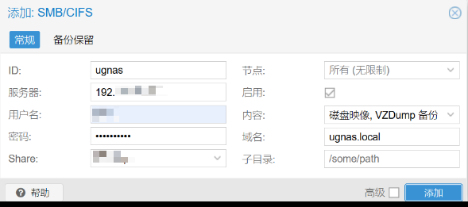
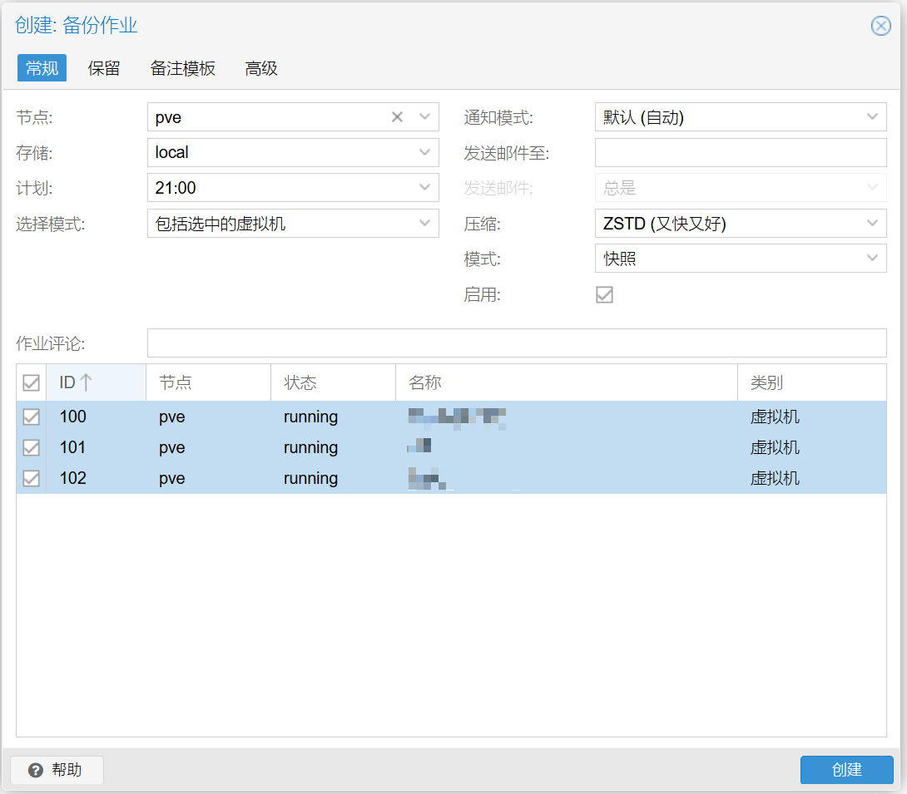

# PVE 系统备份到 NAS(smb)

本文编写时的环境:

* PVE 版本:

## 1 - 添加 NAS 存储

首先确保 NAS 已经开启了 SMB，并且已经创建了用于备份的共享文件夹（假设文件夹名为 `Backup`）。

进入 PVE 控制台，点击左侧的“数据中心”（Datacenter），然后在右侧选择“存储”（Storage）选项，点击“添加”（Add）按钮，选择 “SMB/CIFS”。

填写如下参数添加 SMB 存储:

* ID：自定义的存储名称（假设叫做 `ugnas`）
* 服务器（Server）：NAS 的 IP 地址（经测试，不支持域名）
* 用户名（Username）/密码（Password）：NAS 的用户名和密码
* Share: NAS 上的用于备份的共享文件夹名称（假设为 `Backup`）
* 内容（Content）：添加 `VZDump 备份`（`VZDump backup file`）选项

其余参数保持默认即可。

## 2 - 开启备份

在 PVE 控制台左侧，点击“数据中心”（Datacenter），然后在右侧选择“备份”（Backup）选项，点击“添加”（Add）按钮。

在弹出的“创建：备份作业”对话框中填写如下参数:

* “常规”(General)选项卡:
  * 节点(Node): 默认（`--所有--`|`--All--`）即可
  * 存储(Storage): 选择刚刚添加的 NAS 存储（`ugnas`）
  * 计划(Schedule): 按需选择备份的时间和频率
  * 选择模式(Schedule mode): 默认（`包括选中的虚拟机`|`Include selected VMs`）即可
    * 在下方表格勾选要备份的虚拟机
  * 通知模式(Notification mode): `默认（自动）`|`Default (Auto)`。不配置通知
    * 发送邮件至(Send email to)：留空。不发送邮件通知
  * 压缩(Compression): 默认（`ZSTD`）即可
  * 模式(Mode)：默认（`快照`|`Snapshot`）即可
  * 启用(Enable): 勾选
* “保留”(Retention)选项卡，按需设置保留策略。我的设置是：
  * 保留上次(Keep Last)：3 (保留 3 份最近备份)
  * 保留每天(Keep Daily)：7 (保留 7 份每天的最后一次备份，与上一项不重复)
  * 保留每周(Keep Weekly)：4 (保留 4 份每周的最后一次备份，与之前项不重复)
  * 保留每月(Keep Monthly)：6 (保留 6 份每月的最后一次备份，与之前项不重复)

> 关于保留规则可以参考文档: <https://pve-7hcm7fpg.kooldns.cn/pve-docs/chapter-vzdump.html#vzdump_retention>

## 3 - 恢复备份

在 PVE 控制台左侧点击你添加的 smb 存储，然后点击“备份”(Backup)按钮，选择你需要恢复的备份，点击“还原”(Restore)按钮即可。

还原可完整还原原虚拟机数据和配置，还可以重新调整存储位置。
