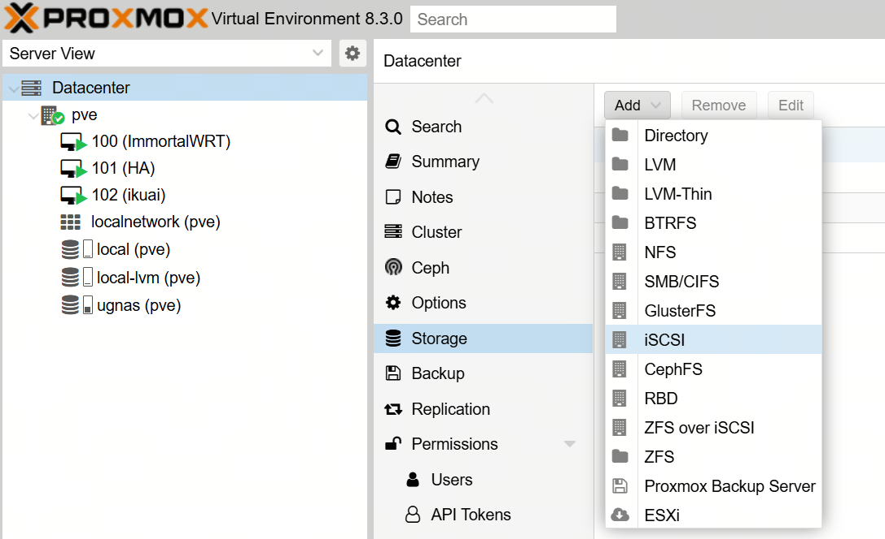
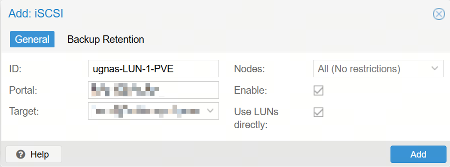

# PVE 使用 iSCSI 存储

> 关于 iSCSI 存储服务的介绍，可以参考 [NAS 开启 iSCSI 服务](../NAS/开启iSCSI服务.md)。

## 1. 添加 iSCSI 存储

1. 在 PVE 管理页面，点击左侧的 "数据中心" ("Datacenter")，然后点击右侧的 "存储" ("Storage") -> "添加" ("Add") -> "iSCSI"。

2. 在弹出的窗口中，填写如下参数:

* ID: 自定义的存储名称
* Portal: iSCSI 服务器的 IP 和端口 (仅填写IP时，使用默认端口 `3260`)
* 目标 (Target): 填写完 Portal 后，会自动带出选项，选择正确的 Target 即可
* 启用 (Enabled): 默认勾选
* 直接使用 LUN (Use LUNs directly): 默认勾选
  * 如果勾选，iSCSI 存储可以直接被虚拟机使用
  * 如果未勾选，iSCSI 存储被挂载在系统上，需要创建分区，然后配置给虚拟机使用
* 节点 (Nodes): 默认为 `所有 (无限制)` (`All (No restrictions)`)，即所有节点都可以使用该存储

3. 点击 "保存" ("Save")，等待添加完成。

添加完成后，可以在左侧的 "数据中心" ("Datacenter") 的节点中看到刚刚添加的 iSCSI 存储。

选中这个存储后，如果在这个 iSCSI Target 上映射了多个 LUN，都可以在右侧的 "VM 磁盘" ("VM Disks") 中看到。

## 2. 使用 iSCSI 存储

在创建虚拟机时，在硬盘设置中，选用上述 "VM 磁盘" 作为虚拟机的磁盘映像即可。
